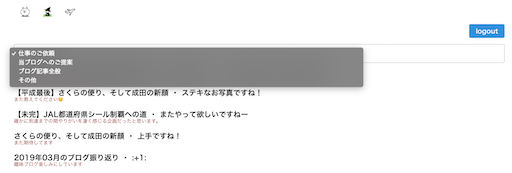

# nuxt-admin

```bash
# Local Dev Server
yarn dev
```

## Admin 本番環境

https://nuxtadmin.netlify.com/

### トップページ


## Storybook 開発環境

https://j-stylebook.netlify.com/

## 設計原則

テンプレートコンポーネントとその他各エンティティに、小〜中規模程度のコンポーネントを準備します。

AtomsコンポーネントはStorybookで運用します。

```bash
yarn add @storybook/vue @storybook/addon-actions @storybook/addon-links @storybook/addon -D
yarn add @vue/cli-plugin-babel @vue/cli-plugin-eslint @vue/cli-service -D
yarn add node-sass sass-loader typescript -D
```

tailwindcssをインストールします。

```bash
yarn add tailwindcss
```

インストール後 tailwindcss.jsを準備します。

```bash
./node_modules/.bin/tailwind init tailwind.config.js
```
